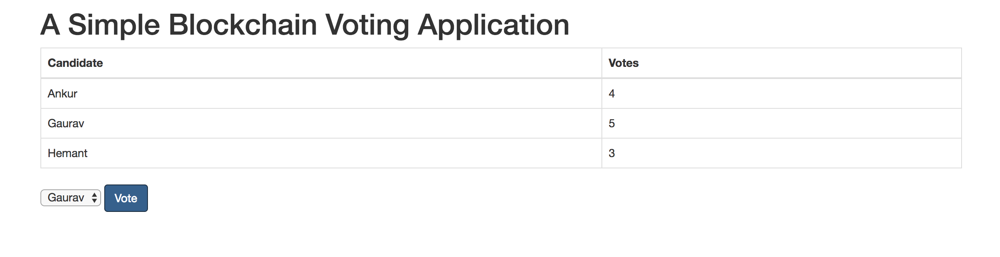

# Build your First Decentralized Application (DApp) Tutorial

A quick tutorial to get your first DApp up and running without any frameworks!

By Anil Kumar <br/>
Created: 18-AUG-2018 <br/>

Install Dependencies:
1. ganache-cli ```npm install ganache-cli web3@0.20.2```
2. solc ```npm install solc```

Directions:
1. Git Clone this repository
2. Run ganache-cli ```node_modules/.bin/ganace-cli```
3. In new terminal open up Nodejs console ```node``` and initialize web3 object
```
 Web3 = require('web3')
 web3 = new Web3(new Web3.providers.HttpProvider("http://localhost:8545"));
```
4. Compile the contract
  ```
  code = fs.readFileSync('Voting.sol').toString()
  solc = require('solc')
  compiledCode = solc.compile(code)
  ```

5. Deploy the contract
  ```
  abiDefinition = JSON.parse(compiledCode.contracts[':Voting'].interface)
  VotingContract = web3.eth.contract(abiDefinition)
  byteCode = compiledCode.contracts[':Voting'].bytecode
  deployedContract = VotingContract.new(['Ankur','Gaurav','Hemant'],{data: byteCode, from: web3.eth.accounts[0], gas: 4700000})
  contractInstance = VotingContract.at(deployedContract.address)
  ```


Interacting with contract through nodejs console
```
> contractInstance.totalVotesFor.call('Ankur')
Output: BigNumber { s: 1, e: 0, c: [ 4 ] }

> contractInstance.voteForCandidate('Ankur', {from: web3.eth.accounts[0]})
Output: '0x08ea2f904072c6a5012fa5bc65d7f652932edba45c69b38ea805dc4a8156549e'

> contractInstance.voteForCandidate('Gaurav', {from: web3.eth.accounts[0]})
Output: '0xb818b809d7e1131ffd9fa2023c6dc190c97587c95d6c290c88e814e51c3f9026'

> contractInstance.voteForCandidate('Hemant', {from: web3.eth.accounts[0]})
Output:  '0x23a0d608b07a4ee444741088962072608029a6a6c9f71dca549e5c6c65cda9a8'

> contractInstance.totalVotesFor.call('Ankur').toLocaleString()
Output: '1'
```

Interacting with contract via front GUI
1. Update the contract instance address in index.js
  * Can run command ```contractInstance.address``` to find address
2. Open index.html in your browser


``` 
{
  "errorMessage": "SSH Key file name should not contain [\\, ;, %, ?, :]"
}
```
